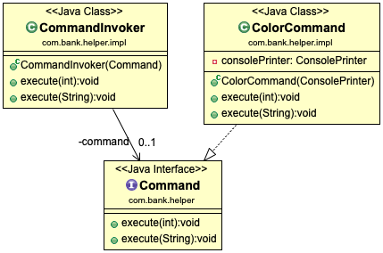
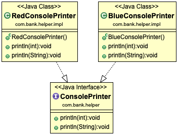
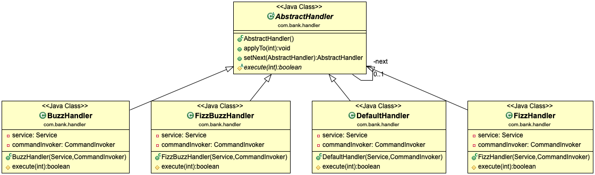
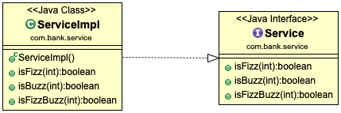
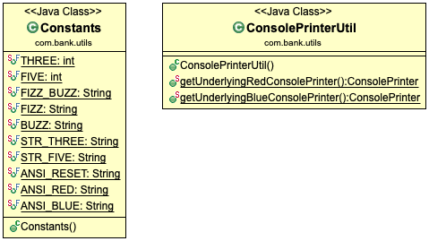

# Fizz Buzz
The app prints the numbers from 1 to 100. But for multiples of three print `Fizz` instead of the number
and for the multiples of five print `Buzz`. For numbers which are multiples of both three and five print `FizzBuzz`.

#### Sample Output:
```
1
2
Fizz
4
Buzz
Fizz
7
8
Fizz
Buzz
11
Fizz
Fizz
14
FizzBuzz
16
17
Fizz
19
Buzz
... etc up to 100
```

[Click here for JavaDoc.](https://ozinal.github.io/fizz-buzz/)

Please make sure you've installed maven and use the commands below to build service.

```
$ mvn clean build
```

Use the command below to test the service.
```
$ mvn test
```
##

## Command Invoker, Command and Color Command
`Command Invoker` takes `Color Command` implements `Command` interface and use relevant implementations methods overridden.



## Console Printer, Red and BlueConsolePrinter

Both `RedConsolePrinter` and `BlueConsolePrinter` implements `ConsolePrinter` interface. Colour printers provide colourful
text output and implementation is passed through `ColorCommand` class that implements `Command` interface.



There are two methods to implement, `println(int i)` and `println(String i)`

## Abstract Handler, Default, Fizz, Buzz and FizzBuzz Handlers

Handlers are there to call different service methods in `ServiceImpl` class that implements `Service` interface.
`AbstractHandler` hold `toApply(int i)` to process the integer received and `setNext(AbstractHandler handler)` to progress
integer to multiple handlers.



`Fizz` condition is responsible to handle three and multiples and the input contains three.
`Buzz` condition is responsible to handle five and multiples and the input contains five.
`FizzBuzz` condition is responsible to handle both three, five and their multiples and the input contains three and five.

## Service interface and ServiceImpl class


`ServiceImpl` class implements `Service` interface, the implementation has `isFizz`, `isBuzz` and `isFizzBuzz` methods that's been run by individual handlers.

## Utils and Constants


`ConsolePrinterUtil` class has two methods that returns `RedConsolePrinter` and `BlueConsolePrinter` instances.

`Constants` class has required numbers and strings required by other class and interfaces